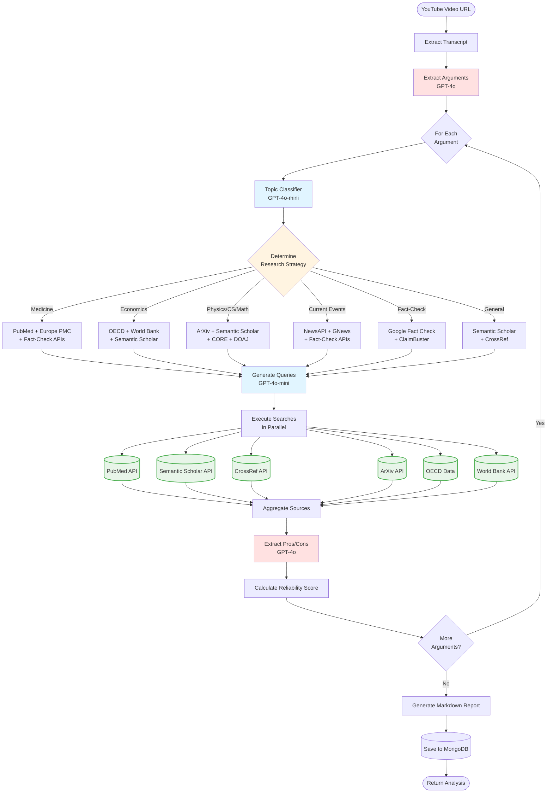

# Video Analyzer Workflow

API HTTP pour analyser des vidéos YouTube via un workflow d'agents.

## Stack

- FastAPI (API)

- MongoDB (stockage)
- Motor (driver async)
- yt-dlp / ffmpeg (ingest vidéo au besoin)

## Démarrage rapide

### 1. Créer le fichier `.env`

Créez un fichier `.env` à la racine du projet avec le contenu suivant:

```env
DATABASE_URL=mongodb://mongo:27017
OPENAI_API_KEY=votre_clé_openai_ici
ENV=development

# Optional: News & Fact-Check APIs
NEWSAPI_KEY=votre_clé_newsapi
GNEWS_API_KEY=votre_clé_gnews
GOOGLE_FACTCHECK_API_KEY=votre_clé_google
CLAIMBUSTER_API_KEY=votre_clé_claimbuster
```

**Note importante**:

- `OPENAI_API_KEY` est **requis** pour l'extraction d'arguments
- Les autres clés sont optionnelles (services sautés si non configurés)

### 2. Lancer les services Docker

```bash
docker compose up -d --build
```

Cela va démarrer:

- L'API FastAPI sur le port 8000
- MongoDB (base de données)

### 3. Vérifier que tout fonctionne

Vérifier les logs:

```bash
docker compose logs -f api
```

Ou vérifier que l'API répond:

```bash
curl http://localhost:8000/docs
```

### 4. Tester l'endpoint d'analyse

```bash
curl -X POST http://localhost:8000/analyze \
  -H "Content-Type: application/json" \
  -d '{"youtube_url": "https://www.youtube.com/watch?v=dQw4w9WgXcQ"}'
```

Réponse attendue:

- Si première analyse: `{"video_id": "...", "status": "queued", "result": null}`
- Si déjà analysé: `{"video_id": "...", "status": "completed", "result": {"arguments": [...]}}`

### 5. Tester les services de recherche

```bash
# Test all research APIs
python tests/test_research_services.py

# Test specific category
python tests/test_research_services.py --category news
python tests/test_research_services.py --category factcheck

# Verbose output
python tests/test_research_services.py -v
```

See `tests/README.md` for details.

## Configuration

- Variables dans `.env` (voir `.env.example`):
  - `DATABASE_URL`
  - `OPENAI_API_KEY` (ou autre LLM provider)

## Workflow Diagram


