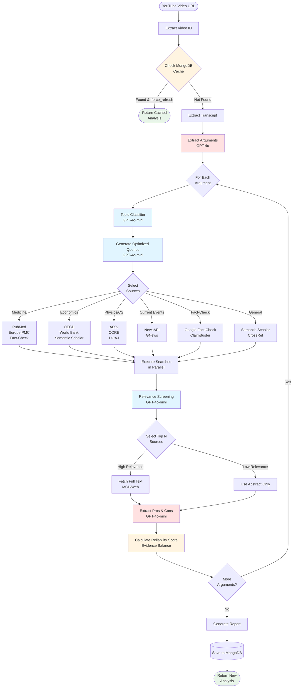

# Video Analyzer Workflow

API HTTP pour analyser des vidéos YouTube via un workflow d'agents.

## Stack

- FastAPI (API)

- MongoDB (stockage)
- Motor (driver async)
- yt-dlp / ffmpeg (ingest vidéo au besoin)

## Démarrage rapide

### 1. Créer le fichier `.env`

Créez un fichier `.env` à la racine du projet avec le contenu suivant:

```env
DATABASE_URL=mongodb://mongo:27017
OPENAI_API_KEY=votre_clé_openai_ici
ENV=development

# Optional: News & Fact-Check APIs
NEWSAPI_KEY=votre_clé_newsapi
GNEWS_API_KEY=votre_clé_gnews
GOOGLE_FACTCHECK_API_KEY=votre_clé_google
CLAIMBUSTER_API_KEY=votre_clé_claimbuster
```

**Note importante**:

- `OPENAI_API_KEY` est **requis** pour l'extraction d'arguments
- Les autres clés sont optionnelles (services sautés si non configurés)

### 2. Lancer les services Docker

```bash
docker compose up -d --build
```

Cela va démarrer:

- L'API FastAPI sur le port 8000
- MongoDB (base de données)

### 3. Vérifier que tout fonctionne

Vérifier les logs:

```bash
docker compose logs -f api
```

Ou vérifier que l'API répond:

```bash
curl http://localhost:8000/docs
```

### 4. Tester l'endpoint d'analyse

```bash
curl -X POST http://localhost:8000/analyze \
  -H "Content-Type: application/json" \
  -d '{"youtube_url": "https://www.youtube.com/watch?v=dQw4w9WgXcQ"}'
```

Réponse attendue:

- Si première analyse: `{"video_id": "...", "status": "queued", "result": null}`
- Si déjà analysé: `{"video_id": "...", "status": "completed", "result": {"arguments": [...]}}`

### 5. Tester les services de recherche

```bash
# Test all research APIs
python tests/test_research_services.py

# Test specific category
python tests/test_research_services.py --category news
python tests/test_research_services.py --category factcheck

# Verbose output
python tests/test_research_services.py -v
```

See `tests/README.md` for details.

## Configuration

- Variables dans `.env` (voir `.env.example`):
  - `DATABASE_URL`
  - `OPENAI_API_KEY` (ou autre LLM provider)

## Workflow Diagram


### Workflow Components

**0. Cache Check** (MongoDB)
- Extract video ID from URL
- Check MongoDB for existing analysis
- Return cached result if found (unless `force_refresh=true`)
- Skip to end if cache hit (saves time & API costs)

**1. Extraction** (GPT-4o)
- Extract transcript from YouTube video
- Identify substantive arguments with stance detection

**2. Orchestration** (GPT-4o-mini)
- Classify argument topic (medicine, economics, news, etc.)
- Generate optimized queries for each research API
- Select appropriate sources based on topic

**3. Research** (API Clients)
- Execute parallel searches across 13+ sources:
  - **Medical**: PubMed, Europe PMC
  - **Scientific**: ArXiv, CORE, DOAJ, Semantic Scholar
  - **Economic**: OECD, World Bank
  - **News**: NewsAPI, GNews
  - **Fact-Check**: Google Fact Check, ClaimBuster

**4. Enrichment** (GPT-4o-mini)
- Screen sources by relevance (top N selection)
- Fetch full text for high-relevance sources
- Use abstracts only for low-relevance sources

**5. Analysis** (GPT-4o-mini)
- Extract supporting evidence (pros)
- Extract contradicting evidence (cons)
- Calculate reliability score (0.0-1.0)

**6. Output**
- Generate Markdown report
- Save to MongoDB
- Return complete analysis
