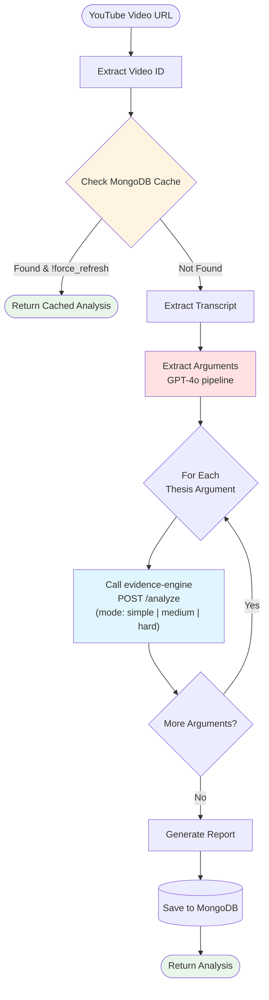

# Video Analyzer Workflow

HTTP API for analyzing YouTube videos via an agent-based workflow.

## Services

| Repo | Responsibility |
|------|---------------|
| `video-analyzer-workflow` (this repo) | Transcript extraction + argument extraction |
| [`evidence-engine`](https://github.com/Thomas-D40/evidence-engine) | Argument analysis backend (research, pros/cons, reliability scoring) |

## Stack

- FastAPI (API)
- MongoDB + Motor (async driver)
- yt-dlp / ffmpeg (video ingest fallback)
- httpx (HTTP client for evidence-engine)

## Quick Start

### 1. Create `.env`

```env
DATABASE_URL=mongodb://mongo:27017
OPENAI_API_KEY=sk-...
ENV=development
EVIDENCE_ENGINE_URL=https://evidence-engine.yourdomain.com
EVIDENCE_ENGINE_API_KEY=your-api-key-here
```

### 2. Start Docker services

```bash
docker compose up -d --build
```

### 3. Verify

```bash
docker compose logs -f api
curl http://localhost:8000/docs
```

### 4. Analyze a video

```bash
curl -X POST http://localhost:8000/api/analyze \
  -H "Content-Type: application/json" \
  -d '{"youtube_url": "https://www.youtube.com/watch?v=dQw4w9WgXcQ"}'
```

## Documentation

- [`docs/architecture.md`](docs/architecture.md) — Package structure, evidence-engine contract, database schema
- [`docs/workflow.md`](docs/workflow.md) — End-to-end pipeline, argument extraction, evidence-engine delegation
- [`docs/setup.md`](docs/setup.md) — Environment variables and troubleshooting

## Workflow Diagram


```mermaid
graph TD
    Start([YouTube Video URL]) --> VideoID[Extract Video ID]
    VideoID --> CacheCheck{Check MongoDB Cache}

    CacheCheck -->|Found & !force_refresh| Return([Return Cached Analysis])
    CacheCheck -->|Not Found| Extract[Extract Transcript]

    Extract --> Arguments[Extract Arguments\nGPT-4o pipeline]

    Arguments --> Loop{For Each\nThesis Argument}

    Loop --> EvidenceEngine["Call evidence-engine\nPOST /analyze\n(mode: simple | medium | hard)"]

    EvidenceEngine --> LoopEnd{More Arguments?}
    LoopEnd -->|Yes| Loop
    LoopEnd -->|No| Report[Generate Report]

    Report --> SaveCache[(Save to MongoDB)]
    SaveCache --> End([Return Analysis])

    style CacheCheck fill:#fff4e1
    style Arguments fill:#ffe1e1
    style EvidenceEngine fill:#e1f5ff
    style Return fill:#e8f5e9
    style End fill:#e8f5e9
```

### Workflow Components

**0. Cache Check** (MongoDB)
- Extract video ID from URL
- Check MongoDB for existing analysis
- Return cached result if found (unless `force_refresh=true`)

**1. Extraction** (GPT-4o pipeline)
- Extract transcript from YouTube video
- Identify substantive arguments with stance detection
- Produce hierarchical `ArgumentStructure` (thesis → sub-arguments → evidence)

**2. Evidence Engine** (HTTP delegation)
- For each thesis argument: `POST {EVIDENCE_ENGINE_URL}/analyze`
- Returns: `pros`, `cons`, `reliability_score`, `consensus_ratio`, `consensus_label`
- Analysis depth controlled by `mode` parameter (simple/medium/hard)

**3. Output**
- Generate Markdown report
- Save to MongoDB
- Return complete analysis
