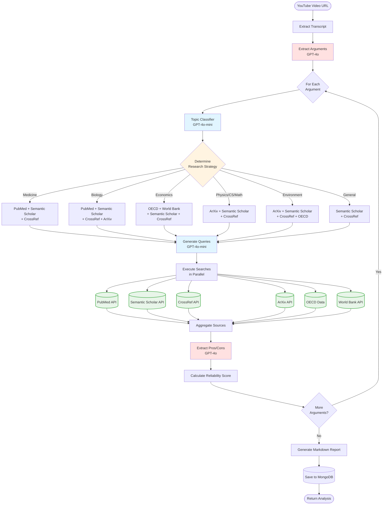

# Specialized Research Agents Workflow

This document explains the new intelligent agent selection system that optimizes research by using specialized sources based on the argument topic.

## Overview

The workflow now uses a **topic classifier** to determine which research agents to use for each argument, ensuring:
- **Cost efficiency**: Only relevant APIs are called
- **Energy efficiency**: Fewer unnecessary requests
- **Better quality**: Domain-specific sources provide more relevant results

## Research Agents by Specialty

### Medicine & Health
- **PubMed**: 39M+ biomedical citations (NCBI)
  - Free API, no key required
  - Best for: health claims, medical research, drug studies

### General Academic
- **Semantic Scholar**: 200M+ papers across all disciplines
  - Free API, AI-powered relevance
  - Best for: interdisciplinary topics, general research

- **CrossRef**: Academic publication metadata with DOI
  - Free API, citation counts
  - Best for: verifying publication credibility

- **ArXiv**: Physics, CS, Math, Economics preprints
  - Free API
  - Best for: cutting-edge research, technical topics

### Economics & Statistics
- **OECD**: Economic and social statistics for developed countries
  - Free access
  - Best for: GDP, unemployment, education, health spending

- **World Bank**: Development indicators for all countries
  - Free API
  - Best for: poverty, economic development, global statistics

### Note on Web Search
General web search (DuckDuckGo) has been **removed** from the system as it often returned low-quality or disconnected sources. The system now relies exclusively on high-quality academic and official sources for better reliability.

## Workflow Diagram



## Cost Optimization Strategy

### Model Selection

The system uses two OpenAI models strategically:

| Task | Model | Reason |
|------|-------|--------|
| Topic Classification | GPT-4o-mini | Simple categorization task |
| Query Generation | GPT-4o-mini | Straightforward keyword extraction |
| Argument Extraction | GPT-4o | Requires nuanced understanding |
| Pros/Cons Analysis | GPT-4o | Complex reasoning about evidence |

**Cost savings**: ~70% cheaper by using mini for simple tasks

### API Usage Optimization

The classifier ensures we only call relevant APIs:

- **Example 1**: "Le café augmente les risques de cancer"
  - ✅ Calls: PubMed, Semantic Scholar, CrossRef
  - ❌ Skips: ArXiv, OECD, World Bank
  - **Saves**: ~50% of API calls

- **Example 2**: "Le PIB français augmente"
  - ✅ Calls: OECD, World Bank, Semantic Scholar, CrossRef
  - ❌ Skips: PubMed, ArXiv
  - **Saves**: ~33% of API calls

## Topic Categories

The classifier recognizes these categories:

1. **medicine**: Health, diseases, treatments, medical research
2. **biology**: Life sciences, ecology, genetics
3. **psychology**: Mental health, behavior, cognition
4. **economics**: GDP, inflation, trade, markets
5. **physics**: Fundamental physics, cosmology, quantum
6. **computer_science**: Algorithms, AI, software
7. **mathematics**: Pure and applied math
8. **environment**: Climate, pollution, sustainability
9. **social_sciences**: Sociology, anthropology
10. **education**: Learning, pedagogy, education systems
11. **politics**: Government, policy, international relations
12. **general**: Default for uncategorized topics

## Implementation Details

### Topic Classifier (`app/agents/orchestration/topic_classifier.py`)

```python
# Classifies argument into 1-3 categories
categories = classify_argument_topic(argument)
# Returns: ["medicine", "biology"]

# Gets recommended agents for argument
agents = get_agents_for_argument(argument)
# Returns: ["pubmed", "europepmc", "semantic_scholar", "crossref"]

# Gets complete research strategy
strategy = get_research_strategy(argument)
# Returns: {
#   "categories": ["medicine"],
#   "agents": ["pubmed", "europepmc", "semantic_scholar", "crossref"],
#   "priority": "pubmed"
# }
```

### Query Generator (`app/agents/orchestration/query_generator.py`)

```python
# Generate queries for specific agents only
queries = generate_search_queries(
    argument="Le café augmente les risques de cancer",
    agents=["pubmed", "semantic_scholar", "europepmc"]
)
# Returns: {
#   "pubmed": "coffee cancer risk epidemiology",
#   "semantic_scholar": "coffee consumption cancer risk health effects",
#   "europepmc": "coffee consumption cancer risk clinical studies"
# }
```

### Workflow Integration (`app/core/workflow.py`)

The workflow now:
1. Classifies each argument's topic
2. Selects appropriate agents based on classification
3. Generates optimized queries for selected agents only
4. Executes searches in parallel
5. Aggregates results by source type (medical, scientific, statistical)

## API Rate Limits & Best Practices

| API | Rate Limit | Authentication | Notes |
|-----|------------|----------------|-------|
| PubMed | 3 req/sec (10 with key) | Optional API key | Add `NCBI_API_KEY` to config |
| Semantic Scholar | 100 req/5min | None | Respect cooldown periods |
| CrossRef | Variable | None | Use polite headers |
| ArXiv | No strict limit | None | Implemented in library |
| OECD | No strict limit | None | Uses data explorer URLs |
| World Bank | No strict limit | None | Public API |

## Future Enhancements

Potential additions to consider:

1. **Google Scholar** (via SerpAPI): More comprehensive academic search
2. **PubMed Central** (PMC): Full-text articles
3. **Europe PMC**: European biomedical literature
4. **SSRN**: Social sciences preprints
5. **bioRxiv/medRxiv**: Biology/medicine preprints
6. **Cochrane Library**: Systematic reviews for medicine
7. **FRED (Federal Reserve)**: US economic data
8. **Eurostat**: European statistics

## Testing

To test the new workflow:

```bash
# Test topic classification
python -c "
from app.agents.orchestration import classify_argument_topic
print(classify_argument_topic('Le café augmente les risques de cancer'))
"

# Test full workflow
python -m uvicorn app.api:app --reload
# Then use the API: POST /api/analyze with a YouTube URL
```

## Configuration

Add to `.env` if desired:

```env
# Optional: Improve PubMed rate limits
NCBI_API_KEY=your_ncbi_api_key_here
```

## Performance Metrics

Expected improvements with the new system:

- **API calls reduced**: 30-50% fewer requests (only relevant academic sources)
- **Cost reduction**: ~40% lower OpenAI costs (using mini for classification/queries)
- **Response time**: Similar or faster (parallel execution, no slow web scraping)
- **Result quality**: Much better (academic sources only, no low-quality web results)
- **Energy efficiency**: Fewer unnecessary API calls

## License & Legal

All research agents use **free, legal, and publicly accessible APIs**:
- PubMed: Public domain (US government)
- Semantic Scholar: Free for research
- CrossRef: Open API
- ArXiv: Open access
- OECD/World Bank: Public data

All sources are academic or official - no web scraping required.
No API keys are required (except optional NCBI key for higher PubMed rate limits).
